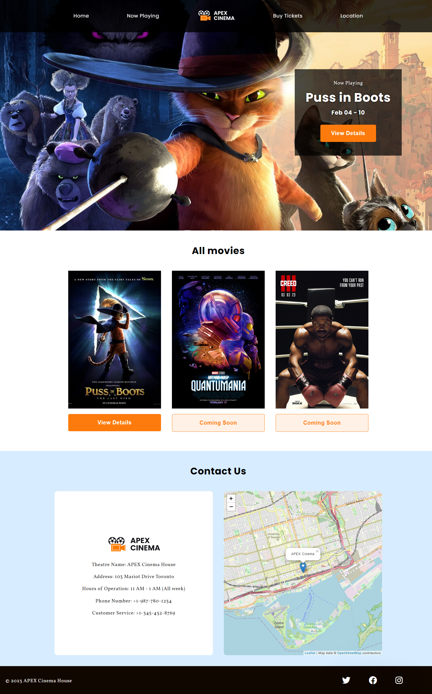
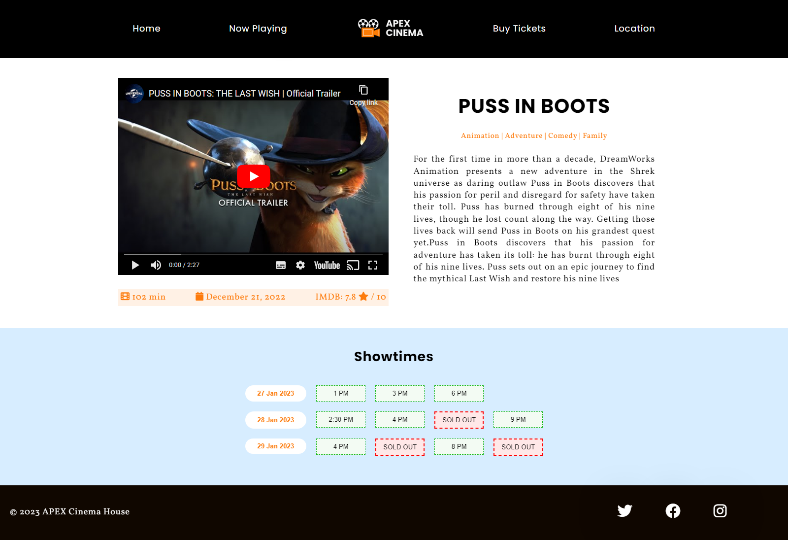
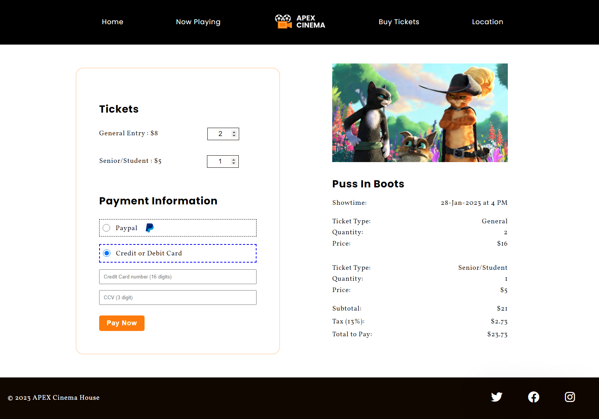

# movie-project-MADS4007

### A website for a local movie theatre

A project I built as a part of my course at George Brown College Toronto.

Live Demo: https://sahil-randhawa.github.io/movie-project-mads4007/

  
  

#### Built using:
- HTML
- CSS
- Vanila Javascript

#### Features:
- Browser Local Storage to preserve variable data.
- Form field validation using vanila javascript.
- Semantic HTML structure.
